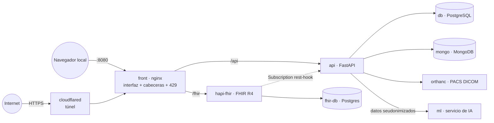
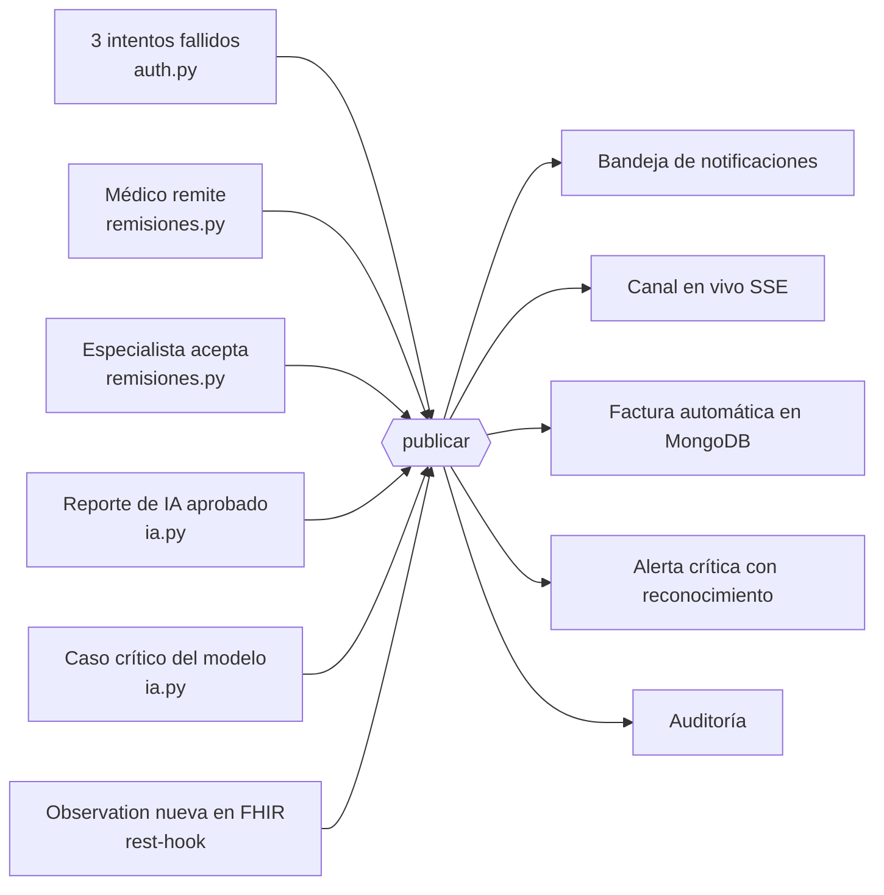

# TrazaRed HUV

Sistema de trazabilidad para la remisión y el traslado de pacientes del Hospital
Universitario del Valle "Evaristo García" (HUV), desarrollado para la asignatura de
Salud Digital (2026-2). Este README corresponde al **Corte 2**: el sistema del Corte 1
convertido en un sistema activo, dockerizado, en línea y con capa de seguridad.

**Equipo:** Luz Angela Carabali Mulato, Laura Daniela Astudillo Ortega, Nicolás Zapata
Obando, David Ortega Quintero.

## El problema

El HUV no cuenta con un proceso trazable ni verificable para gestionar la remisión y el
traslado de pacientes hacia y desde otras instituciones. La gestión se hace caso a caso,
sin un registro único que confirme qué instituciones fueron contactadas, si tenían
disponibilidad, o si existía convenio vigente — un vacío documentado en la Sentencia
T-573-23 de la Corte Constitucional.

TrazaRed HUV registra cada gestión de traslado de forma única y visible para todas las
partes: quién contactó, a quién, cuándo, con qué respuesta, y si existía convenio
vigente.

## Arquitectura

Un solo `docker compose up -d` levanta los nueve servicios (R05). Desde internet solo se
entra por el túnel de Cloudflare, que llega a nginx: ahí se aplican las cabeceras de
seguridad y el límite de peticiones (R03). Las bases, el PACS y el servicio de IA no
están expuestos hacia afuera.



| Servicio | Imagen | Puerto en tu equipo | Qué hace |
|---|---|---|---|
| `front` | nginx:alpine | **8080** | Interfaz (SPA) y puerta única: `/api` → api, `/fhir` → hapi-fhir |
| `cloudflared` | cloudflare/cloudflared | 127.0.0.1:2000 (solo métricas) | Túnel HTTPS público hacia `front` (R04) |
| `api` | propia (`python/Dockerfile`) | 127.0.0.1:8000 | FastAPI: roles, pacientes, remisiones, auditoría, eventos |
| `ml` | propia (`ml/Dockerfile`) | — (solo interno) | Servicio de IA; solo la api le habla (`http://ml:8001`) |
| `db` | postgres:16 | 127.0.0.1:5434 | Base relacional (`db/schema.sql`) |
| `mongo` | mongo:7 | 127.0.0.1:27017 | Gestiones de contacto (y en el Corte 2 facturas y notificaciones) |
| `orthanc` | orthancteam/orthanc | 127.0.0.1:8042 | PACS: imágenes médicas DICOM |
| `hapi-fhir` / `fhir-db` | hapiproject/hapi · postgres:15 | 127.0.0.1:8081 / 5433 | Servidor FHIR R4 y su base |

nginx busca la dirección de `api` y `hapi-fhir` en el DNS interno de Docker en cada
petición, así que reconstruir la API no deja a la interfaz con un 502.

### Diagrama de eventos

Cuando pasa algo importante, el módulo que lo detecta llama a `publicar()` (en
`python/eventos.py`) y de ahí salen las reacciones automáticas (R17–R21). Hoy ya publica
el bloqueo de cuentas; el resto de flujos los conectan las personas 2, 3 y 4.



## Estructura del repositorio

```
TrazaRedHUV/
├── .env.example                  # Plantilla de variables (el .env / pass.env real NUNCA se sube)
├── db/schema.sql                 # Esquema de PostgreSQL (idempotente; la API lo aplica al arrancar)
├── docker/
│   ├── docker-compose.yml        # Los 9 servicios
│   └── nginx.conf                # Puerta única: cabeceras de seguridad, límite 429, /api, /fhir, SSE
├── python/                       # API (FastAPI)
│   ├── main.py                   # Arma la app: CORS, cabeceras, routers, pacientes e imágenes
│   ├── auth.py                   # Conexiones, login con bloqueo, roles, /me, usuarios, auditoría
│   ├── remisiones.py             # Remisiones, soft delete, observaciones, gestiones de contacto
│   ├── ia.py                     # (Persona 2) Análisis de IA con aprobación y seudonimización
│   ├── contabilidad.py           # (Persona 3) Facturación en MongoDB
│   ├── eventos.py                # publicar(): notificaciones, tiempo real, flujos automáticos
│   ├── pacs.py                   # Cliente de Orthanc
│   ├── cargar_dataset.py         # Carga el dataset del proyecto
│   ├── sembrar_imagenes.py       # Base de imágenes en el PACS
│   ├── fhir_sync.py              # Integración PostgreSQL → FHIR
│   └── Dockerfile
├── ml/                           # Servicio de IA (main.py, Dockerfile, requirements.txt)
├── frontend/                     # Interfaz (HTML + CSS + JS, una sola página)
├── data/                         # Dataset del proyecto (CSV) y su diccionario
├── docs/                         # Documentos de entrega
├── notebooks/                    # Cuadernos del Corte 1 y de la semana 8
├── pruebas/probar_persona1.py    # Prueba automática de R01–R05, R13 y R14
├── levantar_demo.py              # Demo del Corte 1 sin Docker
├── documentacion_mapeo_roles.md  # Mapeo BD → FHIR y justificación de roles
└── README.md
```

## Despliegue paso a paso

Requisitos: **Docker Desktop** corriendo (con Docker Compose 2.24 o más nuevo) y Python
3.10+ para las pruebas y los cuadernos.

**1. Variables de entorno.** En la raíz del proyecto, copia la plantilla y llénala con los
valores que el equipo comparte por el canal privado:

```powershell
copy .env.example pass.env
```

La API y el compose leen `.env` y, si no existe, `pass.env`; cualquiera de los dos
nombres sirve. Ninguno se sube nunca al repositorio (están en `.gitignore`).

**2. Levantar todo:**

```powershell
cd docker
docker compose up -d --build
docker compose ps                                   # deben aparecer 9 servicios en "running"
```

Al arrancar, la API actualiza sola el esquema de la base (`db/schema.sql`) y crea un
usuario de prueba por rol con las contraseñas `DEMO_*`.

**3. Cargar los datos** (solo la primera vez):

```powershell
docker compose exec api python cargar_dataset.py    # dataset y usuario paciente
docker compose exec api python sembrar_imagenes.py  # imágenes en el PACS
```

**4. Ver la URL pública del túnel:**

```powershell
docker compose logs cloudflared | findstr trycloudflare
```

o abrir http://localhost:2000/quicktunnel (campo `hostname`). Esa URL se mantiene
mientras el contenedor `cloudflared` no se reinicie, así que **no hay que bajarlo durante
la evaluación** (nada de `docker compose down`). Para una URL fija, ver el servicio
`cloudflared-fijo` del `docker-compose.yml`.

**5. Verificar** (desde la raíz, con el entorno de Python activo):

```powershell
pip install -r requirements.txt
python pruebas\probar_persona1.py
```

La prueba recorre los cinco roles, el bloqueo, los permisos, CORS, las cabeceras, el
límite 429, los nueve servicios, el túnel por HTTPS y la auditoría, e imprime la URL
pública al final de la sección 9.

Local: interfaz en **http://localhost:8080**, documentación de la API en
http://localhost:8000/docs.

## Roles y permisos (R01)

Solo el `admin` crea usuarios y asigna roles; no existe registro público.

| Rol | Puede | No puede |
|---|---|---|
| `admin` | Gestionar usuarios, desbloquear cuentas, restaurar registros, ver la auditoría | Aprobar reportes de IA |
| `medico` | Atender, crear pacientes y remisiones, soft delete de lo suyo | Ver la auditoría, restaurar, crear usuarios |
| `especialista` | Ver pacientes y remisiones, recibir los casos remitidos | Ver la auditoría, crear usuarios |
| `paciente` | Ver solo su propia información | Ver a otros pacientes (404), crear remisiones |
| `contable` | Gestionar la facturación | Ver datos clínicos: pacientes, remisiones (403) |
| `eps` | (Corte 1) Seguir las remisiones de sus afiliados, solo lectura | Modificar |

`GET /me` devuelve el usuario de la sesión con su `rol`.

## Seguridad (R02, R03)

- **Bloqueo:** al 3er intento fallido la cuenta queda bloqueada (423) y no entra ni con la
  clave correcta. Solo el admin desbloquea (`POST /usuarios/{id}/desbloquear`). El bloqueo
  avisa a los admin por `publicar()`.
- **Token en todas las rutas de datos:** sin token, 401.
- **Control por rol:** `requiere_rol(...)` en cada ruta (403 si el rol no corresponde).
- **Contraseñas** con hash bcrypt (passlib), nunca en texto plano.
- **CORS restringido** a `CORS_ORIGINS` (sin `*` y sin reflejar orígenes desconocidos).
- **Cabeceras:** `X-Content-Type-Options: nosniff`, `X-Frame-Options: DENY` y
  `Referrer-Policy: no-referrer`, en nginx y en la API; nginx no anuncia su versión.
- **Límite de peticiones:** nginx responde 429 a quien pase de 10 peticiones por segundo
  (ráfagas de 20), contando por la IP real del visitante (`CF-Connecting-IP`). La
  adivinación de contraseñas ya la frena el bloqueo al 3er intento.
- **Secretos:** en el repositorio solo está `.env.example`; `.env` y `pass.env` están en
  `.gitignore` y `.dockerignore`.
- **Superficie mínima:** bases, PACS, FHIR y API se publican solo en `127.0.0.1`; el
  servicio de IA no se publica.

## Auditoría (R13)

Cada acción relevante queda en la tabla `auditoria`. Solo el admin la consulta con
`GET /auditoria`, y cada fila trae `usuario` (quién), `accion` (qué), `recurso` (sobre
qué, p. ej. `pacientes/12`) y `fecha` (cuándo). Se puede filtrar por `accion`,
`usuario_id`, `tabla` (tipo de recurso) y `registro_id`.

Acciones registradas hoy: `login_exitoso`, `login_fallido`, `login_bloqueado`,
`bloqueo_usuario`, `desbloqueo_usuario`, `usuario_creado`, `paciente_creado`,
`remision_creada`, `soft_edit`, `soft_delete`, `restaurar`, `imagen_subida` e
`imagen_vista`. La creación de pacientes no guarda datos personales en el detalle: el id
basta para rastrearla. En la interfaz, el admin las ve en la sección **Auditoría**.

## Modelo de datos

**PostgreSQL:**
- `pacientes` — nombre, documento (único), género, EPS y datos de la ficha
- `usuarios` — rol, vínculo opcional a paciente o EPS, intentos fallidos y bloqueo
- `remisiones` — paciente, instituciones de origen y destino, motivo, estado, convenio,
  `creado_por`, `activo` (soft delete)
- `observaciones` — signos vitales con código LOINC
- `remisiones_historial` — estado anterior de cada remisión (soft edit)
- `auditoria` — quién hizo qué, sobre qué recurso y cuándo

**MongoDB:**
- `gestiones_contacto` — bitácora de intentos de contacto por remisión
- (Corte 2) facturas y notificaciones

El dataset del proyecto (600 remisiones sintéticas en tres grupos: efectiva, fallida y
borderline) y su diccionario están en [`data/README.md`](data/README.md).

## Interoperabilidad FHIR

`fhir_sync.py` sincroniza los datos de negocio con el servidor HAPI FHIR (R4):

| Tabla PostgreSQL | Recurso FHIR |
|---|---|
| `pacientes` | `Patient` |
| `remisiones` | `Encounter` |
| `observaciones` | `Observation` |

El detalle del mapeo está en [`documentacion_mapeo_roles.md`](documentacion_mapeo_roles.md).
HAPI tiene activadas las suscripciones `rest-hook` para avisar a la API cuando llega un
dato nuevo (R21).

## Imágenes médicas (PACS)

Orthanc guarda las imágenes como DICOM, enlazadas al paciente por `PatientID` =
documento. La API las lista (`GET /pacientes/{id}/imagenes`), las recibe
(`POST /pacientes/{id}/imagenes`: solo PNG/JPEG ≤ 15 MB, re-codificadas para borrar
EXIF) y las entrega (`GET /imagenes/{id}/preview`), siempre con token, rol clínico y
registro en la auditoría. La ficha del paciente tiene un visor con brillo, contraste,
negativo, zoom y desplazamiento.

## Credenciales de demostración (datos sintéticos)

La API crea estos usuarios al arrancar; el paciente lo crea `cargar_dataset.py`.

| Rol | Usuario | Clave (variable en `.env` / `pass.env`) |
|---|---|---|
| Admin | `admin@trazared.huv` | `DEMO_ADMIN_PASSWORD` |
| Médico | `medico@huv.gov.co` | `DEMO_MEDICO_PASSWORD` |
| Especialista | `especialista@huv.gov.co` | `DEMO_ESPECIALISTA_PASSWORD` |
| Contable | `contable@huv.gov.co` | `DEMO_CONTABLE_PASSWORD` |
| Paciente | `paciente@correo.com` | `DEMO_PACIENTE_PASSWORD` |
| EPS (Coosalud) | `eps@coosalud.com` | `DEMO_EPS_PASSWORD` |

Las contraseñas **no están en el repositorio**: se comparten por el canal privado y se
rotan antes de la sustentación.

## Demo del Corte 1 sin Docker (`levantar_demo.py`)

<!-- URLS-DEMO:ini -->
URLs públicas generadas el **2026-09-08 08:30** con `levantar_demo` (Quick Tunnel:
efímeras — cambian en cada arranque):

- **API (FastAPI):** https://collar-september-finals-warming.trycloudflare.com — `/docs` verificado
- **Servidor FHIR (HAPI):** https://housewives-privacy-colour-ipod.trycloudflare.com — `/fhir/metadata` verificado
<!-- URLS-DEMO:fin -->

`python levantar_demo.py` levanta la API local contra Neon y Atlas, HAPI y dos túneles
con `cloudflared` instalado en el equipo. Desde el Corte 2 el túnel oficial es el
servicio `cloudflared` del `docker-compose.yml`.

## Entregables

**Corte 1**
- [x] Modelo relacional, servidor FHIR R4 e integración BD → FHIR
- [x] Roles con JWT, soft delete, soft edit y restauración
- [x] Documentación técnica: mapeo BD → FHIR y justificación de roles

**Semana 8**
- [x] Bloqueo al 3er intento fallido, con auditoría y desbloqueo por admin
- [x] Dataset del proyecto, proyecto dockerizado, PACS con visor e interfaz por rol

**Corte 2 — Persona 1 (seguridad e infraestructura)**
- [x] API partida en módulos (`auth`, `remisiones`, `ia`, `contabilidad`, `eventos`), con `publicar()` lista para los flujos automáticos
- [x] R01 · Cinco roles; solo el admin crea usuarios; `/me` devuelve el rol
- [x] R02 · El bloqueo avisa al admin por `publicar()`
- [x] R03 · Token, control por rol, CORS, cabeceras, límite 429, solo `.env.example`
- [x] R04 · `cloudflared` como servicio del compose, con HTTPS público
- [x] R05 · Nueve servicios con un solo `docker compose up`, incluido `ml`
- [x] R13 · Auditoría con usuario, acción, recurso y fecha, con filtros
- [x] R14 · Soft delete del médico y restauración solo del admin
- [x] `tester.yaml` con la plantilla oficial del profesor y todas las rutas del Corte 2
